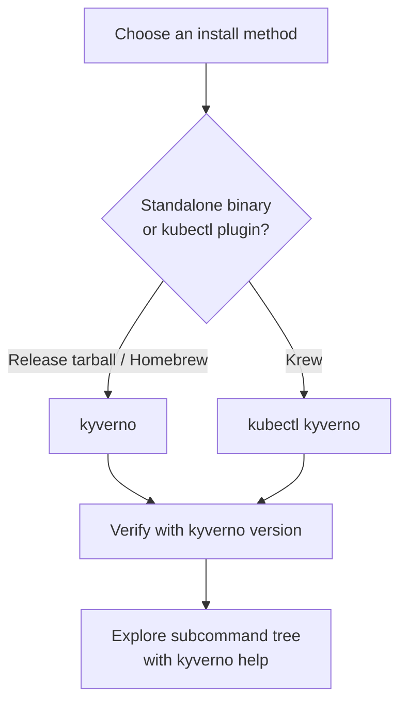

# Installing & Verifying the Kyverno CLI

Before you can write a single policy, you need a working `kyverno` binary. That sounds trivial, but the Kyverno project actually ships the CLI through several different channels, and they don't all produce the same thing: some give you a standalone `kyverno` command, others give you a `kubectl` plugin invoked as `kubectl kyverno`. Picking the wrong one for your workflow — or skipping verification and finding out three commands later that the binary is broken — costs you real time, and real exam points.

This module is where you sort that out once, properly.

## How this module is organised

1. **[Part 1 — Installation Methods](./course-01-installation-methods.md)** — the release binary, Homebrew, and the Krew plugin, and the invocation form each one produces.
2. **[Part 2 — Verifying Installation & CLI Structure](./course-02-verifying-installation-and-cli-structure.md)** — reading `kyverno version` output, navigating `kyverno help`, and enabling shell completion.

## Learning objectives

After this module you can:

- Install the Kyverno CLI from a GitHub release tarball for a specific version and architecture.
- Install the Kyverno CLI with Homebrew and with Krew, and explain the difference in how each is invoked afterward.
- Read `kyverno version` output to confirm the exact version, build time, and commit you have installed.
- Navigate `kyverno help` to find the right subcommand (`apply`, `test`, `jp`, and others) without consulting external docs.
- Enable shell completion for the `kyverno` command.

## Before you start

No prior Kyverno experience is required — this module assumes nothing except basic shell comfort (`curl`, `tar`, editing `PATH`). The linked lab gives you a kind Kubernetes cluster with Kyverno's controller already running; installing the CLI itself is your task inside that lab.
