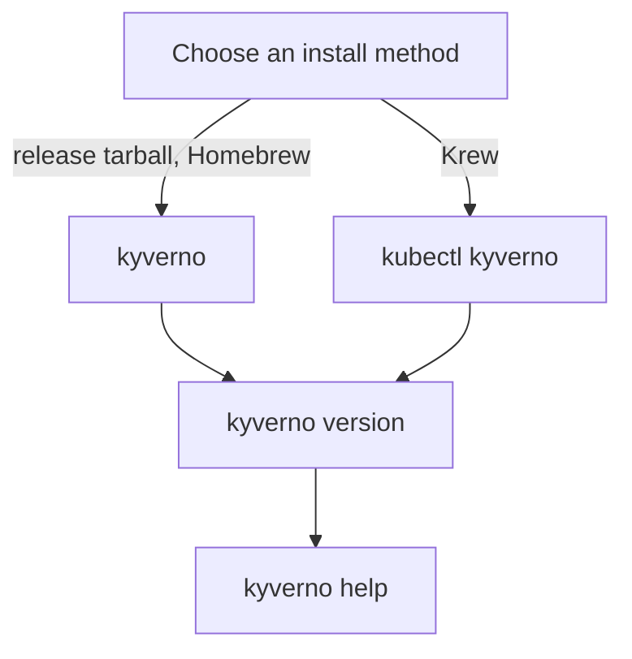

# Installing & Verifying the Kyverno CLI

Astronaut, your first mission is to get your tools on board. Kyverno is a policy engine for Kubernetes: inside a cluster it acts as the docking inspector, checking every new spaceship (Pod) against a rulebook before it may dock. The Kyverno command-line interface (CLI) is a handheld rulebook scanner. It carries the same checking logic, but you run it yourself, from your own console, often with no cluster at all.

The Kyverno project ships that scanner in more than one way, and they do not all give you the same thing. Some methods give you a standalone `kyverno` command. Others give you a plugin that you call as `kubectl kyverno`. If you pick the wrong one, or skip the check at the end, you find out three commands later that nothing works. That costs real time, on the job and in the exam.

This module sorts that out once, properly.

Both install paths end the same way: you read the version, then you explore the commands with `help`.

## Learning objectives

After this module you can:

- Install the Kyverno CLI from a GitHub release tarball for a specific version, operating system and processor type.
- Install the Kyverno CLI with Homebrew and with Krew, and explain how you call it after each one.
- Read `kyverno version` to confirm the exact version, build time and commit you installed.
- Find the right subcommand (`apply`, `test`, `jp` and others) with `kyverno help`, without looking anything up.
- Generate a shell completion script for the `kyverno` command.

## Before you start

You need no Kyverno experience for this module. A few shell basics are enough, and the commands work on your own machine.

### What you should already know

- **Basic shell commands.** Downloading a file with `curl`, unpacking it with `tar`, and copying it with `cp`.
- **What `PATH` is.** `PATH` is the tool rack your console searches when you type a command name. A program only runs by name if it sits in one of the folders on that rack.

### What is waiting in your mission

The graded mission for this module starts a training solar system (a `kind` cluster) with the Kyverno controller `v1.13.2` already running in the namespace `kyverno`. The CLI is **not** installed there. Installing it is your task.

You can try every command in the parts on your own Linux or macOS machine first. Nothing here needs a cluster.

## How this module is organised

1. **[Installation Methods](./course-01-installation-methods.md)**: the release tarball, Homebrew, the Krew plugin and building from source, and the command name each one gives you.
2. **[Verifying Installation & CLI Structure](./course-02-verifying-installation-and-cli-structure.md)**: reading `kyverno version`, finding the binary your shell runs, navigating `kyverno help`, and turning on shell completion. It ends with your graded mission.
3. **[Wrap-Up: Mission Debrief](./course-03-wrap-up.md)**: what you learned, your mission, questions to check yourself, and cleaning up.

## Why this matters

Every other Kyverno CLI task, from testing a policy to debugging an expression, starts with a working binary. A wrong version on your `PATH` gives you results that do not match what the cluster does, and nothing warns you. Two minutes of checking now saves an hour of confusion later.
