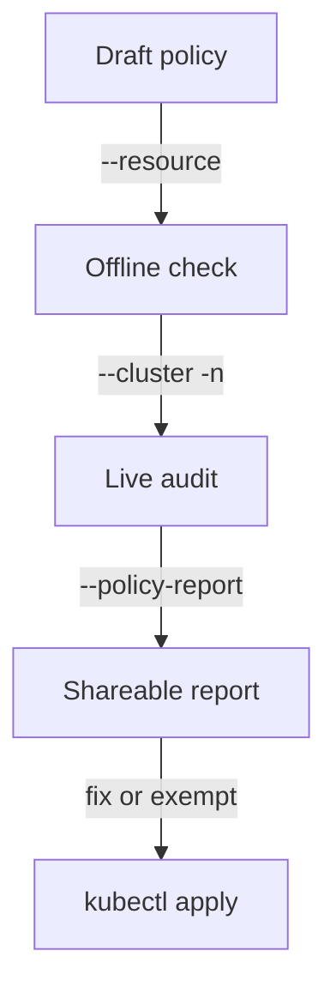

# Applying Against a Live Cluster & Policy Reports

Astronaut, offline checks are perfect for blueprints you are still drawing. But the most useful question is often a different one: "if I switched this rule on right now, which ships already docked in my solar system would break it?" This part points the scanner at a live cluster with `--cluster`, keeps it to one planet with `--namespace`, and writes the result as a formal inspection report with `--policy-report`.

## From local files to live objects

`--cluster` (short form `-c`) changes where the resources come from. Instead of reading files from disk, `kyverno apply` fetches the matching resources from the cluster your `kubeconfig` currently points at.

### Scan the docked ships

Point the policy at the live cluster:

```sh
kyverno apply policy.yaml --cluster
```

The Kyverno CLI asks the Kubernetes API server (mission control's front desk) for the resources the policy matches, and checks each one. It prints the same summary as an offline run.

This never creates, changes or admits anything. It is still a read-only check, only now against live objects instead of files. That makes it the safest way to answer "would this policy break anything if I applied it for real?" before you run `kubectl apply -f policy.yaml`.

> [!TIP]
> Make this a habit: write a policy, run `kyverno apply policy.yaml --cluster` to see what already fails, fix or exempt those resources, and only then apply the policy for real. Skipping this step is how a well-meant policy takes down a production namespace on its first day.

## Limit the scan to one planet

Without a limit, `--cluster` can check resources in every namespace your credentials can see. In a big solar system that is slow, and the result is hard to read.

### Scan one namespace

Add `-n` (long form `--namespace`) to check only one planet:

```sh
kyverno apply policy.yaml --cluster -n orders
```

The CLI now fetches resources from the namespace `orders` only.

## Write the result as a policy report

The plain summary is easy to read by eye, but hard for other tools to use. `--policy-report` (short form `-p`) prints a structured report instead.

### Generate a report

Add `--policy-report` to the cluster scan:

```sh
kyverno apply policy.yaml --cluster -n orders --policy-report
```

The output is a YAML `ClusterPolicyReport` object: the inspection log, written up as a formal report. It has the same shape as the reports Kyverno's own background controller writes into a cluster (`apiVersion: wgpolicyk8s.io/v1alpha2`). Here, though, the CLI builds it on your side from the `apply` run, and nothing is stored in the cluster.

### What a report looks like

`--policy-report` works offline too, so you can see the shape with no cluster. This is the real report for the `require-team-label` policy against the two Pods `compliant-app` (labelled `team: checkout`) and `legacy-app` (no label), run with `kyverno apply clusterpolicy-require-team-label.yaml --resource pod-compliant-app.yaml --resource pod-legacy-app.yaml --policy-report`:

```yaml
apiVersion: wgpolicyk8s.io/v1alpha2
kind: ClusterPolicyReport
metadata:
  creationTimestamp: null
  name: merged
results:
- message: validation rule 'check-team-label' passed.
  policy: require-team-label
  resources:
  - apiVersion: v1
    kind: Pod
    name: compliant-app
    namespace: apps
  result: pass
  rule: check-team-label
  scored: true
  source: kyverno
  timestamp:
    nanos: 0
    seconds: 1791545618
- message: 'validation error: A non-empty ''team'' label is required on every Pod
    in apps. rule check-team-label failed at path /metadata/labels/'
  policy: require-team-label
  resources:
  - apiVersion: v1
    kind: Pod
    name: legacy-app
    namespace: apps
  result: fail
  rule: check-team-label
  scored: true
  source: kyverno
  timestamp:
    nanos: 0
    seconds: 1791545618
summary:
  error: 0
  fail: 1
  pass: 1
  skip: 0
  warn: 0
```

Unlike the default output, the report lists **every** resource, passing ones included, each with its `policy`, `rule` and `result`. The `summary` at the end holds the same five counts as the summary line.

### Save the report to a file

A report is meant for other tools: a CI step that fails the build on any `fail` entry, or a dashboard that reads it. Redirect it to a file:

```sh
kyverno apply policy.yaml --cluster -n orders --policy-report > report.yaml
```

## Putting it together

The full path of a new policy, from first draft to live rule, uses `kyverno apply` twice:



You prove the rule logic on files first, then audit the live planet, then share the result, and only then switch the rule on.

1. Draft a policy and test it offline against a few typical resource files.
2. Once you trust the rule, point the same command at your real cluster with `--cluster -n <namespace>` to see what fails today.
3. Generate a `--policy-report` for that audit, so the result is structured and easy to share.
4. Only then apply the policy for real with `kubectl apply -f policy.yaml`.

Remember who does what after step 4. The Kyverno controller in the cluster, through its admission webhook, checks **new** ships from then on. Ships that docked before the policy existed keep running; only the background scan notes them in its reports.

## Common pitfalls

> [!WARNING]
> - **Thinking `--cluster` enforces anything.** It only reads and reports. Nothing is admitted, changed or rejected until you apply the policy with `kubectl`.
> - **Scanning the whole cluster by accident.** Without `-n`, `--cluster` checks every namespace you can see. Limit it to the planet you mean.
> - **Expecting the report in the cluster.** The CLI prints the `ClusterPolicyReport` to standard output. Redirect it to a file if you need to keep it.
> - **Expecting an `Enforce` policy to remove old Pods.** Admission checks only run on new requests. A Pod that was already running stays.

## Your mission: Offline & Cluster Policy Apply Lab

You can now check a policy offline, audit a live namespace with `--cluster`, and write the result as a policy report. Now prove it in a graded mission: check the `require-team-label` policy offline against two Pod files, apply it live, audit the `apps` namespace with a report, and show that a new unlabelled Pod is turned away.

Start the mission:

```sh
astrona run --git ssh://git@github.com/astrona-io/ATS009.git -c sections/section-020/module-01/labs/lab-01
```

Read the task in [`question.md`](./labs/lab-01/question.md) and solve it on your own first. When you think you are done, send it for grading:

```sh
astrona submit -c sections/section-020/module-01/labs/lab-01
```

When the mission is done, remove it:

```sh
astrona destroy ats-009-lab-003
```
