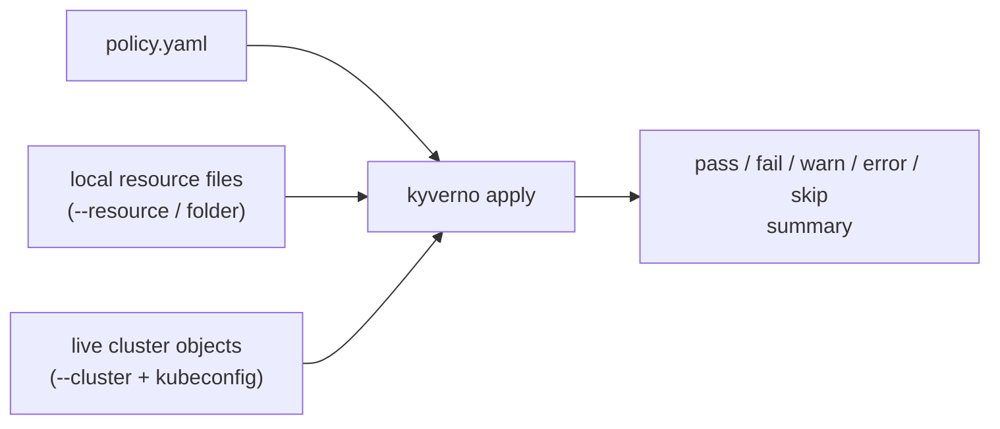

# Applying Policies with the Kyverno CLI

Every policy you will ever write deserves to be proven correct before it can reject a real Pod in a real cluster. `kyverno apply` is how you do that: it runs the exact same rule-evaluation logic the live admission controller uses, but against resources you hand it directly — local YAML files, or objects already sitting in a cluster — with no webhook, no risk, and no waiting for a real request to come along and test your assumptions.

## How this module is organised

1. **[Part 1 — Offline Policy Apply](./course-01-offline-policy-apply.md)** — running `apply` against local files with no cluster, values files for variables, and reading the summary output.
2. **[Part 2 — Applying Against a Live Cluster & Policy Reports](./course-02-applying-against-a-live-cluster-and-policy-reports.md)** — the `--cluster` flag, namespace scoping, and `--policy-report`.

## Learning objectives

After this module you can:

- Run `kyverno apply` against one or more local resource files, offline, with no cluster.
- Supply policy variables to `apply` with a values file (`-f`/`--values-file`) or inline with `--set`.
- Read the CLI's `pass: N, fail: N, warn: N, error: N, skip: N` summary and know what each category means.
- Run `apply` against a live cluster with `--cluster`, scoped to a namespace with `-n`/`--namespace`.
- Generate a policy report with `--policy-report` instead of the default plain-text output.

## Before you start

You should already have the `kyverno` CLI installed and on your `PATH` (Section 010), and be comfortable with basic `kubectl` usage. The linked lab gives you a kind cluster with `kubectl` configured, the Kyverno controller running, and the `kyverno` CLI already installed for you — this section is about the command, not the install.
