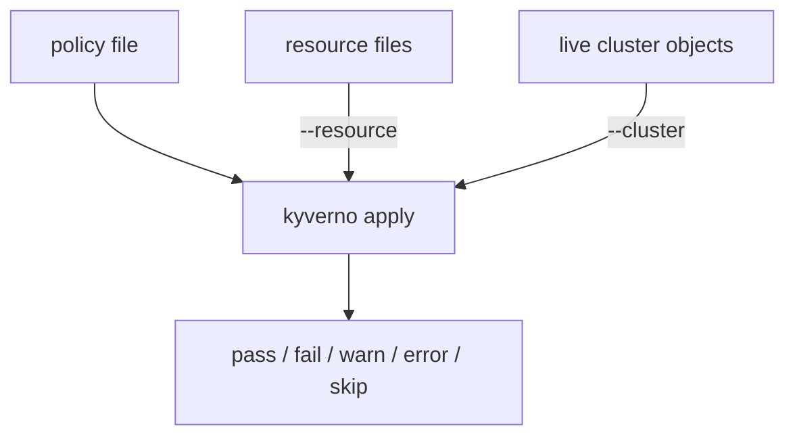

# Applying Policies with the Kyverno CLI

Astronaut, every rule you write for the fleet deserves a test before it can turn a real ship away. Inside a cluster, Kyverno is the docking inspector: it checks every new spaceship (Pod) against the rulebook before it may dock. `kyverno apply` lets you run that same check yourself, from your console. It runs the same rule-checking logic the live admission controller uses, but against resources you hand it: blueprints on paper (local YAML files), or ships already docked in a cluster. No webhook is involved, nothing is changed, and you do not wait for a real request to test your guess.

The command takes a policy and resources from either source, and always answers with the same five kinds of result.

## Learning objectives

After this module you can:

- Run `kyverno apply` against one or more local resource files, offline, with no cluster.
- Read the `pass: N, fail: N, warn: N, error: N, skip: N` summary and say what each kind of result means.
- Use the exit code of `kyverno apply` to stop a script or a pipeline when a policy fails.
- Supply the value of a policy's `context` variable with a values file (`-f`/`--values-file`) or inline with `--set`.
- Run `apply` against a live cluster with `--cluster`, limited to one namespace with `-n`/`--namespace`.
- Generate a policy report with `--policy-report` instead of the plain-text summary.

## Before you start

This module is about one command. You need the tool and a little Kubernetes, nothing more.

### What you should already know

- **The Kyverno CLI is installed.** `kyverno version` must run on your machine. In the missions, the lab installs version `1.13.2` for you.
- **Basic `kubectl`.** Applying a file, listing Pods, and what a namespace is.
- **What a Kyverno policy looks like.** A `ClusterPolicy` is a page of the fleet rulebook for the whole solar system. Each rule on it has a `match` block (which ships it looks at) and a `validate` block (the template the ship's papers must fit).

### What is waiting in your missions

The graded missions start a training solar system (a `kind` cluster) with the Kyverno controller and the `kyverno` CLI `1.13.2` already installed. Each mission also writes its own policy and resource files to disk and creates a few Pods. The offline commands in the parts run on your own machine too: they need no cluster at all.

## How this module is organised

1. **[Offline Policy Apply](./course-01-offline-policy-apply.md)**: running `apply` against local files with no cluster, reading the summary, and using the exit code.
2. **[Supplying Variables With A Values File](./course-02-supplying-variables-with-a-values-file.md)**: answering a policy's `context` lookup with `-f` or `--set` when there is no cluster to ask.
3. **[Applying Against a Live Cluster & Policy Reports](./course-03-applying-against-a-live-cluster-and-policy-reports.md)**: the `--cluster` flag, namespace scoping and `--policy-report`. It ends with your graded mission.
4. **[Wrap-Up: Mission Debrief](./course-04-wrap-up.md)**: what you learned, your mission, questions to check yourself, and cleaning up.

## Why this matters

`kyverno apply` is the Kyverno CLI command you will use most. It answers the question every policy author has before switching a rule on: "what will this rule do to my ships?" You can answer it in seconds, with no risk to a live cluster, and the exam expects you to be fast with it.
