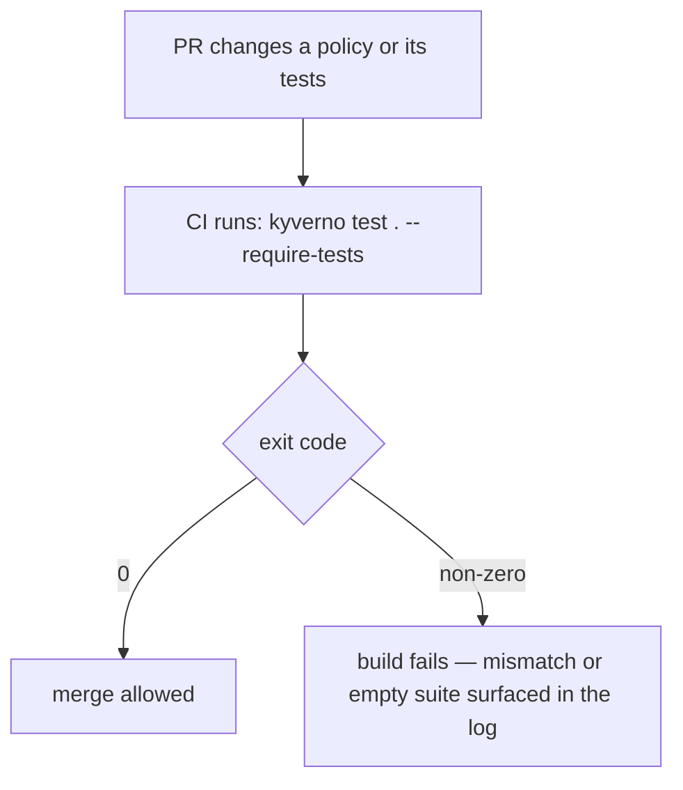

# Part 2 — Running & Interpreting Test Results

> Prerequisite: [Part 1 — Test Manifest Anatomy](./course-01-test-manifest-anatomy.md). Back to: [Landing page](./course.md).

## Running a test suite

```sh
kyverno test .
```

`kyverno test` looks for a file named `kyverno-test.yaml` in the given directory by default. You can point it at more than one location, and each one can be a local folder *or* a remote Git repository:

```sh
kyverno test https://github.com/kyverno/policies/pod-security --git-branch main
```

| Flag | What it does |
| --- | --- |
| `-f, --file-name` | Use a different manifest filename instead of the default `kyverno-test.yaml`. |
| `-b, --git-branch` | Branch to check out when a test target is a Git repository URL. |
| `-t, --test-case-selector` | Run only matching cases, e.g. `"policy=require-run-as-nonroot, rule=check-runAsNonRoot, resource=bad-pod"`. |
| `--detailed-results` | Print a per-check breakdown instead of just a summary. |
| `--fail-only` | Show only the failing cases in the output — useful once a suite gets large. |
| `-o, --output-format` | Emit `json`, `yaml`, `markdown`, or `junit` instead of the default table — `junit` is what most CI dashboards want to ingest. |
| `--require-tests` | Exit non-zero if no test cases were found at all, instead of silently reporting an empty, technically-passing run. |
| `--warnings-as-errors` | Treat CLI deprecation warnings as failures, so a suite doesn't quietly keep passing against a soon-to-be-removed field. |
| `--registry` | Use local Docker credentials to resolve image-related lookups (relevant when testing `verifyImages` rules) during the run. |

> [!TIP]
> **Try it — target one failing case**
>
> ```sh
> kyverno test . --test-case-selector "policy=require-run-as-nonroot, rule=check-runAsNonRoot, resource=bad-pod" --detailed-results
> ```
> Isolating a single case while you're actively debugging its expected `result` is much faster than re-running (and re-reading) the whole suite every time.

## Reading the output

A passing run reports every case that was checked and confirms each one's actual result matched its declared `result`. A failing run instead names the specific `policy`/`rule`/`resource` combination that disagreed, and shows what Kyverno actually computed versus what the manifest claimed. `--detailed-results` widens that same report to cover every case, pass or fail, which is useful when you want to confirm *what actually ran*, not just what broke.

## Exit codes and CI

`kyverno test` exits `0` only when every declared result matches Kyverno's real evaluation. Any mismatch — or, with `--require-tests`, an empty suite — produces a non-zero exit code. That single exit code is the entire contract a CI pipeline needs: wire `kyverno test . --require-tests` into a pull-request check, and a policy change that silently breaks a previously-passing case (or a test manifest quietly emptied of its hard cases) fails the build before it merges.



## Structuring a repo for CI

A common layout keeps each policy's `kyverno-test.yaml`, the policy file, and its test resources together in one directory — often right next to the policy itself, or under a parallel `tests/` tree that mirrors the policy directory structure. Either way, a single top-level CI step can run `kyverno test` once per directory (or point it at the repo root and let it discover every manifest, depending on how your pipeline is scripted), and `-o junit` output lets most CI systems render pass/fail counts natively rather than parsing free-form text.

> [!WARNING]
> **Common pitfall**
>
> Testing a Git repository target without `--git-branch` pulls whatever the remote's default branch is — not necessarily the branch you're actually working on. When testing a fork or a feature branch's policies directly from Git (rather than a local checkout), always pass `--git-branch` explicitly.

## Reference

- `kyverno test --help` — the live flag reference for your installed CLI version.
- Your CI system's documentation for consuming JUnit XML, if you adopt `-o junit`.
