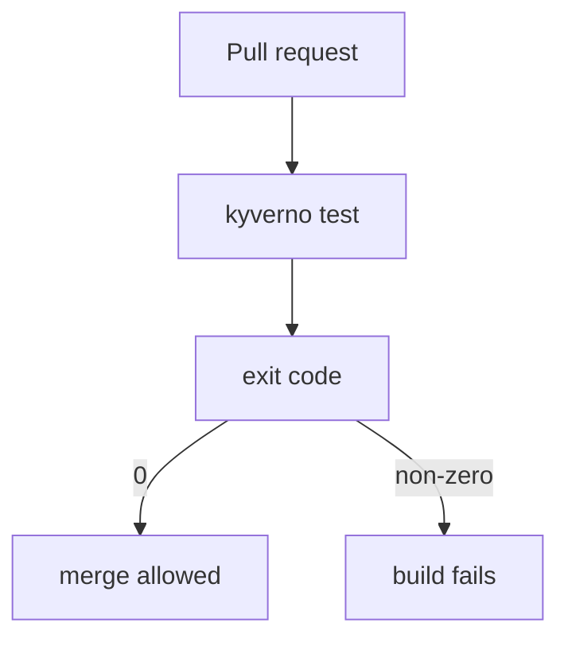

# Running & Interpreting Test Results

Astronaut, a checklist only helps if you run it and read it right. This part shows how to run `kyverno test`, what a failing run looks like, which flags change the run, and how the exit code turns a suite into a gate in a CI pipeline (continuous integration: the launch checklist every change must clear before it leaves the shipyard).

The commands below use a folder with four files: the `require-run-as-nonroot` policy (rule `check-runAsNonRoot`), a `good-pod` that sets `runAsNonRoot: true`, a `bad-pod` with no `securityContext`, and a `kyverno-test.yaml` that expects `pass` for `good-pod` and `fail` for `bad-pod`.

## Run a suite

`kyverno test` looks for a file named `kyverno-test.yaml` in the folder you give it. The target can be a local folder or a remote Git repository.

### Run a local folder

Run the suite in the current folder:

```sh
kyverno test .
```

When every claim matches, the run ends with `Test Summary: 2 tests passed and 0 tests failed`, and the exit code is `0`.

### Run a suite straight from Git

You can also point `kyverno test` at a Git repository and choose the branch:

```sh
kyverno test https://github.com/kyverno/policies/pod-security --git-branch main
```

The CLI fetches the repository and runs every test manifest it finds under that path.

## Read a failing run

The best way to learn the failure output is to cause one on purpose.

### Break one claim

Open `kyverno-test.yaml` and change the `bad-pod` entry from `result: fail` to `result: pass`. Then run the suite again:

```sh
kyverno test .
```

```text
Loading test  ( kyverno-test.yaml ) ...
  Loading values/variables ...
  Loading policies ...
  Loading resources ...
  Loading exceptions ...
  Applying 1 policy to 2 resources ...
  Checking results ...

│────│────────────────────────│────────────────────│──────────────│────────│─────────────────────│
│ ID │ POLICY                 │ RULE               │ RESOURCE     │ RESULT │ REASON              │
│────│────────────────────────│────────────────────│──────────────│────────│─────────────────────│
│ 1  │ require-run-as-nonroot │ check-runAsNonRoot │ Pod/good-pod │ Pass   │ Ok                  │
│ 2  │ require-run-as-nonroot │ check-runAsNonRoot │ Pod/bad-pod  │ Fail   │ Want pass, got fail │
│────│────────────────────────│────────────────────│──────────────│────────│─────────────────────│


Test Summary: 1 tests passed and 1 tests failed

Aggregated Failed Test Cases : 
│────│────────────────────────│────────────────────│─────────────│────────│─────────────────────│
│ ID │ POLICY                 │ RULE               │ RESOURCE    │ RESULT │ REASON              │
│────│────────────────────────│────────────────────│─────────────│────────│─────────────────────│
│ 1  │ require-run-as-nonroot │ check-runAsNonRoot │ Pod/bad-pod │ Fail   │ Want pass, got fail │
│────│────────────────────────│────────────────────│─────────────│────────│─────────────────────│
Error: 1 tests failed
```

The `REASON` column says it all: `Want pass, got fail`. The manifest claimed `pass`, but the Kyverno engine really computed `fail`. The run names the exact policy, rule and resource, repeats the failing cases at the end, and exits with a non-zero code. Change the claim back to `result: fail` before you go on.

## The flags you will use

The flags below change what a run checks and how it reports. Check the spelling for your own binary with `kyverno test --help`.

| Flag | What it does |
| --- | --- |
| `-f, --file-name` | Use another manifest file name instead of the default `kyverno-test.yaml`. |
| `-b, --git-branch` | The branch to check out when the target is a Git repository. |
| `-t, --test-case-selector` | Run only matching cases, for example `"policy=require-run-as-nonroot, rule=check-runAsNonRoot, resource=bad-pod"`. |
| `--detailed-results` | Add a `MESSAGE` column with the rule's message for every case. |
| `--fail-only` | Ask for the failing cases only. In 1.13.2 the main table still lists every case, and the summary line changes to `1 out of 2 tests failed`. |
| `--registry` | Use your local Docker credentials to look up image details during the run (for `verifyImages` rules). |
| `--remove-color` | Print the tables without colour codes, for log files. |
| `-o, --output-format` | Print `json`, `yaml`, `markdown` or `junit` instead of the table; `junit` is what most CI dashboards read. Newer CLIs only (not in 1.13.2). |
| `--require-tests` | Exit non-zero when no test cases are found at all, instead of reporting an empty run as a success. Newer CLIs only (not in 1.13.2). |
| `--warnings-as-errors` | Treat CLI deprecation warnings as failures, so a suite does not keep passing on a field that will soon be removed. Newer CLIs only (not in 1.13.2). |

The last three flags are not in the `1.13.2` CLI that the missions install: `kyverno test --help` there does not list them, and the 1.13.2 binary rejects them with `unknown flag`. Newer CLIs, such as 1.19, have all three.

### Narrow the run while you debug

While you fix one case, you do not want to read the whole suite every time. Add a selector and the detailed messages:

```sh
kyverno test . --test-case-selector "policy=require-run-as-nonroot, rule=check-runAsNonRoot, resource=bad-pod" --detailed-results
```

The `policy` part of the selector narrows the run: a policy name that matches nothing gives `0 tests passed and 0 tests failed`. In the 1.13.2 CLI, this small suite still lists both Pods for `resource=bad-pod`, so read the `RESOURCE` column. `--detailed-results` adds the rule's own message, for example `validation error: spec.securityContext.runAsNonRoot must be set to true.` for `bad-pod`.

## Exit codes and CI

The exit code is the green or red light on the console when the check ends. `kyverno test` exits `0` only when every declared result matches the real one. Any mismatch gives a non-zero code.

That one number is all a CI pipeline needs. Run the suite as a check on every pull request, and a policy change that breaks a case fails the build before it is merged:



The pipeline never reads the table. It only looks at the light.

There is one hole in that gate: an empty suite. Run `kyverno test` on a folder with no test manifest and the 1.13.2 CLI prints `No test yamls available` and exits `0`, green. A suite that someone emptied, instead of fixing, passes the gate. Newer CLIs close that hole with `kyverno test . --require-tests`, which fails a run that finds no test cases. On 1.13.2, check in the pipeline that the test files are really there.

## Structure a repository for CI

A common layout keeps each policy, its test resources and its `kyverno-test.yaml` together in one folder. Some teams put that folder right next to the policy; others use a separate `tests/` tree that mirrors the policy folders.

Either way, one CI step can run `kyverno test` once per folder, or point it at the repository root and let it find every manifest. With a newer CLI, `-o junit` lets most CI systems show pass and fail counts directly, instead of parsing text.

## Common pitfalls

> [!WARNING]
> - **Testing a Git target without `--git-branch`.** The CLI then uses the repository's default branch, which may not be the branch you are working on. Always pass `--git-branch` for a fork or a feature branch.
> - **Trusting a green run of an empty folder.** `No test yamls available` still exits `0`. Make sure the suite really ran test cases.
> - **Copying flags from newer documentation.** `--require-tests`, `-o` and `--warnings-as-errors` do not exist in the 1.13.2 CLI. Check `kyverno test --help` on the binary you have.
> - **Forgetting to undo a deliberate break.** If you flipped a claim to see a failure, flip it back before you commit.

## Your mission: Kyverno Test Suite Lab

You can now run a test suite, read which claim was wrong, and use the exit code as a gate. Now prove it in a graded mission: a `kyverno-test.yaml` claims `pass` for both `good-pod` and `bad-pod` in one entry; find out what Kyverno really decides and fix the manifest without deleting the inconvenient case.

Start the mission:

```sh
astrona run --git ssh://git@github.com/astrona-io/ATS009.git -c sections/section-030/module-01/labs/lab-01
```

Read the task in [`question.md`](./labs/lab-01/question.md) and solve it on your own first. When you think you are done, send it for grading:

```sh
astrona submit -c sections/section-030/module-01/labs/lab-01
```

When the mission is done, remove it:

```sh
astrona destroy ats-009-lab-005
```
