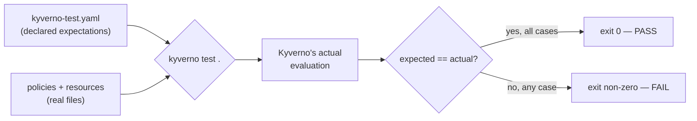

# Writing & Running Kyverno Test Suites

`kyverno apply` proves a policy behaves correctly *right now*, against the resources you hand it. It doesn't stop someone from editing that policy tomorrow and quietly breaking the exact case you already verified. That's the gap `kyverno test` closes: a declarative, repeatable test manifest that says, in writing, "this policy must admit this resource and reject that one" — and fails loudly, in CI, the moment reality stops matching the claim.

This module is where you learn to write that manifest and read what it tells you.

## How this module is organised

1. **[Part 1 — Test Manifest Anatomy](./course-01-test-manifest-anatomy.md)** — the `kyverno-test.yaml` schema: policies, resources, results, and the optional variables and userinfo files.
2. **[Part 2 — Running & Interpreting Test Results](./course-02-running-and-interpreting-test-results.md)** — invoking `kyverno test`, reading its output, exit codes, and wiring it into CI.

## Learning objectives

After this module you can:

- Write a `kyverno-test.yaml` manifest that declares `policies`, `resources`, and expected `results`.
- Correctly assert `pass`, `fail`, `skip`, and `warn` outcomes for a `results` entry, and know when several resource names can safely share one entry.
- Run a test suite from a local directory or a remote Git repository, and select individual cases with `--test-case-selector`.
- Read a `kyverno test` run's output and its exit code to decide whether it's safe to gate a CI pipeline on it.
- Explain why a test suite that always passes (because it was edited to match whatever the tool outputs) provides zero real assurance.

## Before you start

You should already be comfortable authoring a `ClusterPolicy` validate rule (Section 010) and reading it with `kubectl`. No new cluster concepts are introduced here — this module is entirely about the `kyverno` CLI binary and plain files on disk.

The linked lab gives you a kind Kubernetes cluster with the `kyverno` CLI already installed and a broken test manifest waiting in `~/kyverno-cli-lab`.
