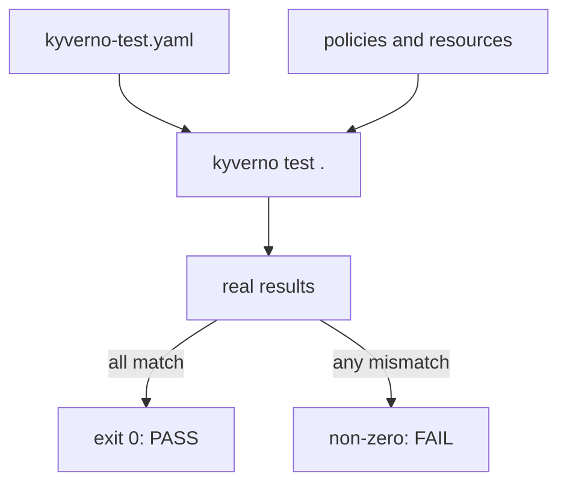

# Writing & Running Kyverno Test Suites

Astronaut, `kyverno apply` proves that a policy does the right thing *today*, against the resources you hand it. It does not stop someone from editing that policy tomorrow and quietly breaking the case you already checked. `kyverno test` closes that gap. You write a test manifest: a pre-flight checklist with the expected verdict next to every line, such as "this rule must clear this ship and turn that one away". The Kyverno CLI runs the real checks, compares them with your checklist, and fails loudly the moment the two disagree.

This module teaches you to write that checklist and to read what it tells you.

The test command runs the real check on your files and compares each result with the one your manifest expects; one mismatch is enough to fail the run.

## Learning objectives

After this module you can:

- Write a `kyverno-test.yaml` manifest that lists `policies`, `resources` and the expected `results`.
- Assert `pass`, `fail`, `skip` and `warn` correctly, and know when several resources can share one `results` entry.
- Run a test suite from a local folder or a remote Git repository, and narrow a run with `--test-case-selector`.
- Read the output and the exit code of `kyverno test`, and decide whether a CI pipeline can rely on it.
- Explain why a suite that always passes, because someone edited it to match the tool's output, proves nothing.

## Before you start

This module is about the `kyverno` CLI and plain files on disk. No new cluster ideas come up.

### What you should already know

- **How a Kyverno `validate` rule works.** A `ClusterPolicy` is a page of the fleet rulebook. A `validate` rule with a `pattern` is a template the ship's papers must fit, and `match` says which ships the rule looks at.
- **How `kyverno apply` reports.** It checks a policy against resource files and reports `pass`, `fail`, `warn`, `error` or `skip` for each one.

### What is waiting in your mission

The graded mission starts a training solar system (a `kind` cluster) with the `kyverno` CLI `1.13.2` installed, and a folder `~/kyverno-cli-lab` with a policy, two Pods and a broken test manifest. Every command in the parts also runs on your own machine, with no cluster.

## How this module is organised

1. **[Test Manifest Anatomy](./course-01-test-manifest-anatomy.md)**: the `kyverno-test.yaml` file: `policies`, `resources`, `results`, the optional `variables` and `userinfo` files, and when resources can share an entry.
2. **[Running & Interpreting Test Results](./course-02-running-and-interpreting-test-results.md)**: running `kyverno test`, reading its table, the exit code, and wiring it into CI. It ends with your graded mission.
3. **[Wrap-Up: Mission Debrief](./course-03-wrap-up.md)**: what you learned, your mission, questions to check yourself, and cleaning up.

## Why this matters

A policy change is safe to merge only when someone has checked that it still clears the right ships and turns away the right ones. Reading every YAML change by hand does not scale. A test suite does that check every time, in seconds, and its exit code is something a pipeline can act on.
