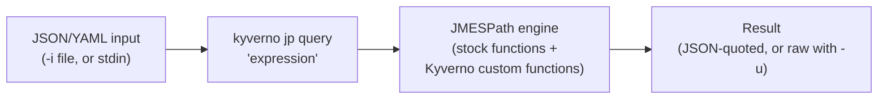

# JMESPath with the Kyverno CLI

Every Kyverno policy that reads `request.object.metadata.labels.team`, or filters a list with `[?status=='Running']`, or reaches for a helper like `truncate(@, \`9\`)`, is writing JMESPath — the query language Kyverno embeds throughout `context`, `preconditions`, `foreach`, and variable substitution. If a policy misbehaves because an expression evaluates to `null` or the wrong value, the cause is almost always a JMESPath expression that didn't do what you expected.

`kyverno jp` gives you a standalone command-line interface to that exact same JMESPath engine — the real one Kyverno runs in-cluster, including its Kyverno-specific custom functions — so you can build and debug an expression against a sample JSON payload before it ever goes near a live policy or a webhook.

## How this module is organised

1. **[Part 1 — JMESPath Fundamentals via kyverno jp query](./course-01-jmespath-fundamentals-via-kyverno-jp-query.md)** — core JMESPath syntax, the real `kyverno jp query` flags, and reading/writing input and output correctly.
2. **[Part 2 — Kyverno's Custom JMESPath Functions](./course-02-kyvernos-custom-jmespath-functions.md)** — `kyverno jp function` as your live function reference, and worked examples of the string, hashing, math, time, and Kubernetes-aware functions Kyverno adds on top of stock JMESPath.

## Learning objectives

After this module you can:

- Write JMESPath expressions using identifiers, dot notation, index/wildcard projections, filter expressions, and pipe (`|`) chaining.
- Use `kyverno jp query` correctly: feeding it a file with `-i`, reading a query from a file with `-q`, printing unquoted string results with `-u`, and producing compact JSON with `-c`.
- Distinguish raw string literals (`'text'`) from JSON literals (`` `9` ``, `` `true` ``) in a JMESPath expression, and explain why using the wrong one is a common source of "expression evaluates to null" bugs.
- Use `kyverno jp function` to list every Kyverno custom JMESPath function and look up the exact signature of one before using it.
- Explain why debugging a JMESPath expression with `kyverno jp` before dropping it into a `context`/`preconditions`/`foreach` block saves an entire apply-and-inspect cycle against a live cluster.

## Before you start

You should already be comfortable reading JSON and YAML, and have seen a Kyverno policy's `match`/`validate` blocks from earlier domains. No prior JMESPath experience is required — this module teaches it from first principles.

The linked lab gives you a kind Kubernetes cluster with `kubectl`, a live Kyverno installation, and the `kyverno` CLI already on `PATH`. Every command in this module is meant to be run in that cluster's terminal.
