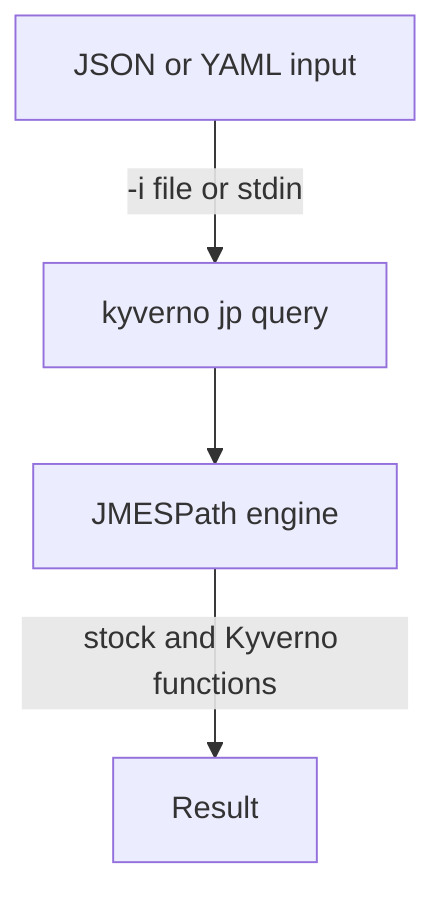

# JMESPath with the Kyverno CLI

Astronaut, every Kyverno policy that reads `request.object.metadata.labels.team`, filters a list with `[?status=='Running']`, or calls a helper like ``truncate(@, `9`)`` is written in JMESPath. JMESPath is a query language for JSON documents: the star-chart language you use to point at one exact star in a chart. Kyverno uses it in `context` entries, `preconditions`, `foreach` loops and variable substitution. When a policy misbehaves because a value is wrong or missing, the cause is very often a JMESPath expression that did not do what you expected.

`kyverno jp` is the navigation computer for that language. It runs the same JMESPath engine Kyverno runs inside the cluster, including Kyverno's own extra functions, from your console. You can build and debug an expression against a sample JSON file before it ever goes near a live policy or a webhook.

You hand the navigation computer a chart and a question; the engine reads back the answer, quoted as JSON or, with `-u`, as plain text.

## Learning objectives

After this module you can:

- Use `kyverno jp query` correctly: read a file with `-i`, read the expression from a file with `-q`, print plain strings with `-u`, and print compact JSON with `-c`.
- Write JMESPath expressions with dot notation, indexes, `[*]` projections, `[?...]` filters and `|` pipes.
- Tell raw string literals (`'text'`) from JSON literals (`` `9` ``, `` `true` ``), and fix the errors you get when you mix them up.
- Use `kyverno jp function` to list Kyverno's custom functions and to read the exact signature of one before you use it.
- Explain why testing an expression with `kyverno jp` first saves a whole apply-and-inspect round trip against a live cluster.

## Before you start

This module teaches JMESPath from the beginning. You only need to be able to read a small JSON or YAML file.

### What you should already know

- **JSON and YAML.** Objects (keys and values), lists, strings, numbers and `true`/`false`.
- **The shape of a Kubernetes object.** `metadata.name`, `metadata.labels`, and `spec.containers` as a list of containers, each with a `name` and an `image`.

### What is waiting in your missions

The graded missions start a training solar system (a `kind` cluster) with Kyverno and the `kyverno` command-line interface (CLI) `1.13.2` installed, plus a JSON file to query and an empty `answers/` folder. Every command in the parts also runs on your own machine: `kyverno jp` never needs a cluster.

## How this module is organised

1. **[Meet kyverno jp query](./course-01-jmespath-fundamentals-via-kyverno-jp-query.md)**: what JMESPath is, the `kyverno jp query` command, its flags, and how to read its output.
2. **[Core JMESPath Syntax And Literals](./course-02-core-jmespath-syntax-and-literals.md)**: dot notation, indexes, projections, filters and pipes, and the difference between `'text'` and `` `9` ``.
3. **[Kyverno's Custom JMESPath Functions](./course-03-kyvernos-custom-jmespath-functions.md)**: `kyverno jp function` as your live manual, and worked examples of Kyverno's string, matching and other functions. It ends with your graded mission.
4. **[Wrap-Up: Mission Debrief](./course-04-wrap-up.md)**: what you learned, your mission, questions to check yourself, and cleaning up.

## Why this matters

Debugging an expression inside a live policy is slow: edit the YAML, apply it, trigger a request, then read logs or a report to guess what the expression returned. With `kyverno jp`, you save a sample file once and try an expression in seconds. What works there works the same in the cluster, because it is the same engine.
